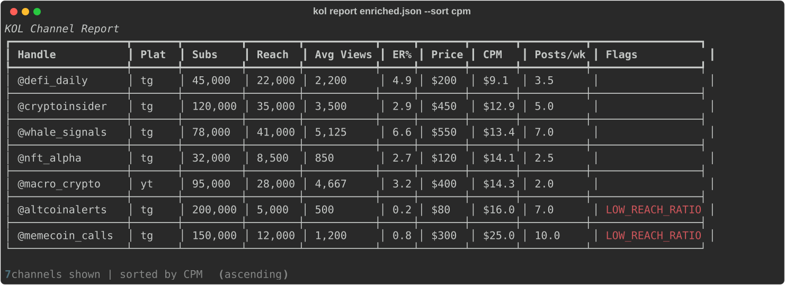

# KOL/Influencer Analytics Toolkit

CLI that unifies Telegram + YouTube channel scraping into one analytics pipeline: subscribers, reach, ER%, CPM, posting frequency, fraud detection, deduplication, and export to CSV/XLSX.

[](LICENSE)
[](https://www.python.org/downloads/)

Built for crypto/Web3 KOL marketing — evaluate influencers before spending budget.



## Features

- **Scrape** Telegram and YouTube channels with watchdog timeouts and resume support
- **Enrich** with CPM (cost per mille), ER% tier classification, fraud flags
- **Dedup** channels case-insensitively with minimum non-zero price rule
- **Report** with rich terminal tables, filterable and sortable
- **Export** to CSV or XLSX

## Install

```bash
# Core (metrics, dedup, report only)
pip install -e .

# With Telegram scraping
pip install -e ".[telegram]"

# With YouTube scraping
pip install -e ".[youtube]"

# Everything
pip install -e ".[all]"
```

### Telegram Setup

1. Get API credentials at https://my.telegram.org
2. Set environment variables:
```bash
export TG_API_ID=12345
export TG_API_HASH=your_hash
```

## Usage

### 1. Scrape channels

```bash
# Telegram
kol scrape channels.txt --platform telegram --resume

# YouTube
kol scrape channels.txt --platform youtube -o yt_scraped.json
```

### 2. Enrich with metrics

```bash
# Add prices from a file (handle<TAB>price)
kol enrich scraped.json --prices prices.txt

# Without prices (skips CPM)
kol enrich scraped.json
```

### 3. Deduplicate

```bash
kol dedup enriched.json
# @CryptoAlpha and @cryptoalpha -> keep the one with lower price
```

### 4. Report

```bash
# Rich table in terminal
kol report enriched.json --sort cpm

# With filters
kol report enriched.json --max-cpm 5.0 --min-er 3.0

# Export
kol report enriched.json --csv report.csv --xlsx report.xlsx
```

### Example Output

```
┏━━━━━━━━━━━━━━━━━━┳━━━━━━━┳━━━━━━━━━━━┳━━━━━━━━━━━┳━━━━━━━━━━━┳━━━━━━┳━━━━━━━━┳━━━━━━━━┳━━━━━━━━━━┳━━━━━━━━━━━━━━━━━━━━━━━━━━━━━━━┓
┃ Handle           ┃ Plat  ┃      Subs ┃     Reach ┃ Avg Views ┃  ER% ┃  Price ┃    CPM ┃ Posts/wk ┃ Flags                         ┃
┡━━━━━━━━━━━━━━━━━━╇━━━━━━━╇━━━━━━━━━━━╇━━━━━━━━━━━╇━━━━━━━━━━━╇━━━━━━╇━━━━━━━━╇━━━━━━━━╇━━━━━━━━━━╇━━━━━━━━━━━━━━━━━━━━━━━━━━━━━━━┩
│ @defi_daily      │ tg    │   45,000  │   22,000  │    2,200  │  4.9 │   $200 │   $9.1 │      3.5 │                               │
│ @cryptoinsider   │ tg    │  120,000  │   35,000  │    3,500  │  2.9 │   $450 │  $12.9 │      5.0 │                               │
│ @altcoinalerts   │ tg    │  200,000  │    5,000  │      500  │  0.2 │    $80 │  $16.0 │      7.0 │ Reach/subs ratio extremely... │
└──────────────────┴───────┴───────────┴───────────┴───────────┴──────┴────────┴────────┴──────────┴───────────────────────────────┘
```

## How It Works

### Price parsing
Handles many formats: `450$`, `$450`, `450 USD`, `€50`, `1.5k$`, `[80$](url)`, `1,200$`

### Deduplication
Telegram usernames are case-insensitive. `@CryptoAlpha` == `@cryptoalpha`. When duplicates are found, the entry with the minimum non-zero price is kept.

### CPM
`CPM = 1000 × price / reach`. Lower is better for advertisers.

### ER%
Engagement Rate comes from TGStat or analytics platforms as input — it's NOT computed from other columns (because true engagement includes reactions, comments, forwards, not just views).

### Fraud flags
| Flag | Severity | Trigger |
|------|----------|---------|
| LOW_REACH_RATIO | high | reach/subs < 5% |
| LOW_REACH_RATIO | medium | reach/subs < 15% |
| HIGH_REACH_RATIO | medium | reach/subs > 150% |
| EXTREME_ER | high | ER > 30% |
| HIGH_ER | medium | ER > 15% |
| LOW_ER | medium | ER < 0.3% (with >1K subs) |
| GROWTH_SPIKE | high | 30d growth > 100% |
| GROWTH_SPIKE | medium | 30d growth > 50% |
| DEAD_VIEWS | high | avg views/subs < 1% |

## Architecture

```
src/kol/
├── cli.py              # Typer CLI: scrape / enrich / dedup / report
├── metrics.py          # Pure functions: parse_price, cpm, er_check
├── fraud.py            # Fraud detection heuristics
├── dedup.py            # Case-insensitive dedup with min-price rule
├── report.py           # Rich table + CSV/XLSX export
└── sources/
    ├── telegram.py     # TG scraper (watchdog, resume, auto-reconnect)
    └── youtube.py      # YT scraper (HTML parsing, checkpoint)
```

## Roadmap

- [ ] MCP server wrapper (Phase 2 — separate project `kol-mcp`)
- [ ] TGStat API integration for ER% auto-fetch
- [ ] Historical tracking (compare snapshots over time)
- [ ] Batch campaign estimator

## License

MIT
